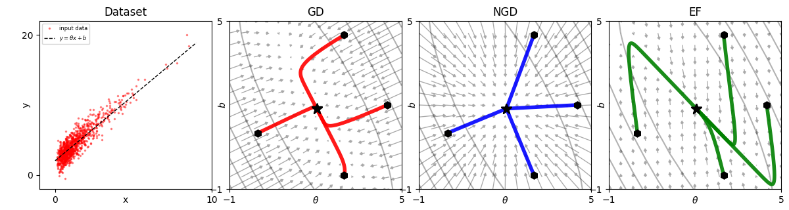

# GGNExperiments
Experiments with Generalised Gauss Newton for NGD and LLA.

The GGN as an approximation to the Hessian is used (i) as a conditioner for the gradient in SGD during training, to produce NGD; (ii) as a way to recover the posterior distribution on the parameters of the model after training. In both cases, there are assumptions about linearity being made. 

---

The GGN is often used as a first approximation to the Hessian, where:

$$
GNN =  \sum_n (J_{\theta} b_n(\theta))^T \nabla_b a_n(b_n(\theta)) J_{\theta} b_n(\theta) 
$$

where $a_n(b_n(\theta))$ is the negative log likelihood or cost function $-\log \mathcal{L} = -\log p(y_n | b_n(\theta))$, which is a function of the model output $b_n(\theta)$. 

In the case where $b_n(\theta)$ is itself a linear function, the GNN is an exact representation of the Hessian, because $\nabla^2_{\theta} b_n(\theta) = 0$. This was demonstrated nicely in [Kunstner+ 2019](https://arxiv.org/pdf/1905.12558) for a linear regression example. That example is reproduced here using a `PyTorch` based model. See my notes on  the Hessian & Jacobian calculations from their [analytic form --> torch --> torch.func](Notes.md).

In this example, the GGN is used to condition the gradient for NGD and the descent becomes perfectly linear. Note the comparison to _empirical Fisher_ on the right, where the split $a_n = -\log (b_n)$ with $b_n = p(y_n | b_n(\theta))$ has been used; this is not a good representation of the Hessian as $\nabla^2_{\theta} b_n(\theta) \neq 0$.

---

For more general _non-linear_ functions of $b_n(\theta)$, such as might be found for a neural network, e.g. $b_n(\theta) = \theta_1 RELU (\theta_2 x_n)$, the GGN is only the Hessian of the linearised function. This can be obtained using a Taylor approximation, as $b_n^{lin}(\theta, \theta') = b_n(\theta) + J_{\theta} b_n(\theta) (\theta' - \theta)$.
