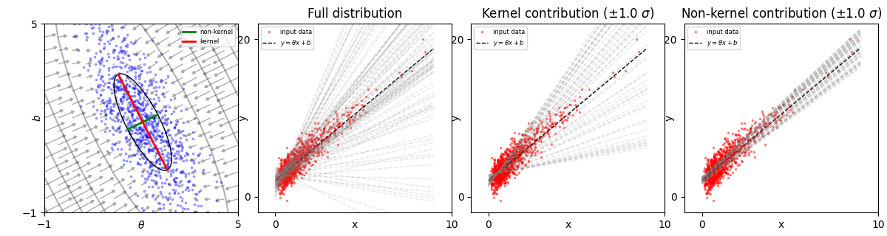

# GGNExperiments

Experiments with Generalised Gauss Newton for NGD and LLA.

The GGN as an approximation to the Hessian is used (i) as a conditioner for the gradient in SGD during training, to produce NGD; (ii) as a way to recover the posterior distribution on the parameters of the model after training. In both cases, there are assumptions about linearity being made. 

---

The GGN is often used as a first approximation to the Hessian, where:

$$
GNN =  \sum_n (J_{\theta} f_n(\theta))^T \nabla_f^2 a_n(f_n(\theta)) J_{\theta} f_n(\theta) 
$$

where $a_n(f_n(\theta))$ is the negative log likelihood or cost function $-\log \mathcal{L} = -\log p(y_n | f_n(\theta))$, which is a function of the model output $f_n(\theta)$. 

### Linear models

In the case where $f_n(\theta)$ is a linear function of $\theta$, the GNN is an exact representation of the Hessian, because $\nabla^2_{\theta} f_n(\theta) = 0$. This was demonstrated nicely in [Kunstner+ 2019](https://arxiv.org/pdf/1905.12558) for a linear regression example. That example is reproduced here using a `PyTorch` based model. See my notes on converting the Hessian & Jacobian calculations from their [analytic form --> torch --> torch.func](Notes.md).


*(axes flipped w.r.t. original paper)*

In this example, the GGN is used to condition the gradient for NGD and the descent becomes perfectly linear. Note the comparison to _empirical Fisher_ on the right, where the split $a_n = -\log (b_n)$ with $b_n = p(y_n | b_n(\theta))$ has been used; this is not a good representation of the Hessian as $\nabla^2_{\theta} b_n(\theta) \neq 0$.

The code to reproduce this experient is in [linear_regression](./linear_regression/). To run:

```
python main.py
```

---

The GGN can also be used to recover a Laplace approximation to the posterior distribution on the model parameters directly:

$$
q(\theta | \mathcal{D}) = \mathcal{N}(\theta | \hat{\theta}, (GGN_{\hat{\theta}} + \alpha I)^{-1}), 
$$

where the prior on the model parameters is defined as $p(\theta) = \mathcal{N}(0, \alpha^{-1} I)$.

For a linear relationship between the parameters, the Laplace approximation will give a reliable approximation to the posterior distribution, but in other cases it is expected to underfit. [Roy+ 2025](https://arxiv.org/pdf/2406.03334) explain this through decomposing the contributions of the approximation into those that represent *reparameterisations* of the function (kernel) and those that represent *functional changes* (non-kernel). For the linear model above these look like this:



*(this is just a toy demo as an intrinsically linear model is perfectly characterised... but it will be the basis for the linearised model later)*

The code to reproduce this experient is in [posterior_approx](./posterior_approx/). To run:

```
python main.py
```
---
### Extension to non-linear models - under construction

For more general _non-linear_ functions of $f_n(\theta)$, such as might be found for a neural network, e.g. $f_n(\theta) = \theta_1 RELU (\theta_2 x_n)$, the GGN is only the Hessian of the linearised function. The linearised function can be obtained using a Taylor approximation, as $f_n^{lin}(\theta, \theta') = f_n(\theta) + J_{\theta} f_n(\theta) (\theta' - \theta)$.
